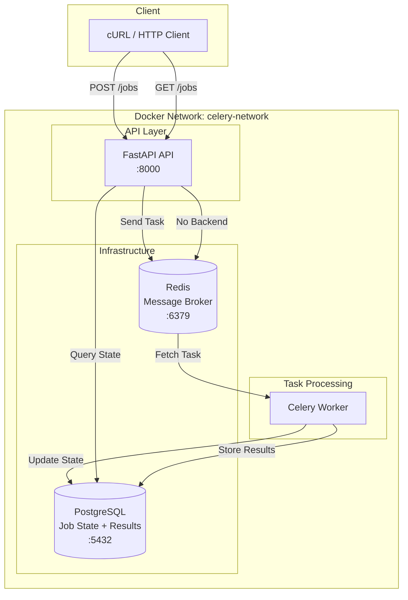
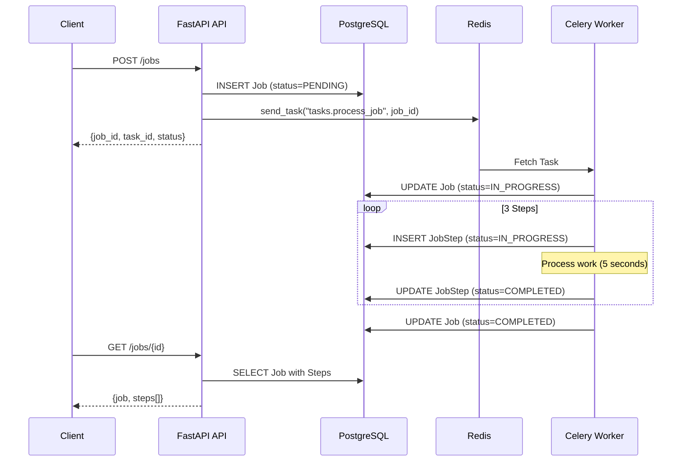
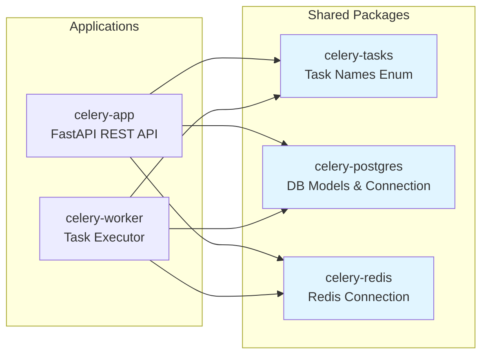

# Celery Playground

Celery, FastAPI, Redis, PostgreSQL을 활용한 분산 작업 처리 시스템 학습 프로젝트

## 프로젝트 개요

3단계 Job 처리 파이프라인을 통해 Celery 기반 비동기 작업 처리를 학습합니다.
- 각 Job은 3개의 Step으로 구성
- 실시간으로 각 Step의 진행 상태 추적
- RESTful API를 통한 Job 생성 및 조회

## 기술 스택

- **Backend**: FastAPI 0.128, Celery 5.6
- **Message Broker**: Redis 7
- **Database**: PostgreSQL 17
- **Package Manager**: uv
- **Containerization**: Docker, Docker Compose
- **Language**: Python 3.13

## 아키텍처

### 시스템 구조



### Job 처리 시퀀스



### 패키지 의존성



## 프로젝트 구조

```
celery-playground/
├── celery-app/                    # FastAPI REST API
│   ├── Dockerfile
│   ├── pyproject.toml
│   └── src/celery_app/
│       ├── __init__.py
│       ├── __main__.py            # 진입점 (python -m celery_app)
│       ├── dependency.py          # Celery 앱 의존성
│       ├── routers/               # API 라우터
│       │   └── job_router.py
│       ├── services/              # 비즈니스 로직
│       │   └── job_service.py
│       ├── repositories/          # DB 접근 계층
│       │   └── job_repository.py
│       └── schemas/               # Pydantic 스키마
│           ├── __init__.py
│           └── job.py
│
├── celery-worker/                 # Celery Worker
│   ├── Dockerfile
│   ├── pyproject.toml
│   └── src/celery_worker/
│       ├── __init__.py
│       ├── __main__.py            # 진입점 (python -m celery_worker)
│       ├── celery_app.py          # Celery 앱 설정
│       └── tasks/                 # Task 구현
│           ├── __init__.py
│           └── process_job.py
│
├── packages/                      # 공유 패키지
│   ├── celery-postgres/           # PostgreSQL 연결 및 모델
│   │   ├── pyproject.toml
│   │   └── src/celery_postgres/
│   │       ├── __init__.py
│   │       ├── connection.py      # SQLAlchemy Engine, Session
│   │       ├── models.py          # Job, JobStep 모델
│   │       └── settings.py        # DB 설정
│   │
│   ├── celery-redis/              # Redis 연결
│   │   ├── pyproject.toml
│   │   └── src/celery_redis/
│   │       ├── __init__.py
│   │       ├── connection.py      # Redis Client
│   │       └── settings.py        # Redis 설정
│   │
│   └── celery-tasks/              # Task 이름 관리
│       ├── pyproject.toml
│       └── src/celery_tasks/
│           ├── __init__.py
│           ├── app.py             # Celery 앱 팩토리
│           └── task_names.py      # TaskNames Enum
│
├── docker-compose.yml             # 컨테이너 오케스트레이션
└── pyproject.toml                 # uv workspace 설정
```

## 핵심 설계 결정

### 1. Task 이름을 Enum으로 관리
**이유**: API와 Worker 간의 명확한 계약(contract)

```python
# packages/celery-tasks/src/celery_tasks/task_names.py
class TaskNames(str, Enum):
    PROCESS_JOB = "tasks.process_job"

# API에서 사용
self.celery_app.send_task(TaskNames.PROCESS_JOB, args=[job.id])

# Worker에서 사용
@celery_app.task(bind=True, name=TaskNames.PROCESS_JOB)
def process_job(self: Task, job_id: int):
    ...
```

**장점**:
- 오타 방지 (IDE 자동완성)
- 중앙 집중식 관리
- API는 Task 구현체에 의존하지 않음 (느슨한 결합)

### 2. Step을 실행 시점에 생성
**이유**: 실제로 발생한 이벤트만 DB에 기록

```python
# 각 Step 시작 시 IN_PROGRESS로 생성
step = JobStep(
    job_id=job_id,
    step_number=step_num,
    status="IN_PROGRESS",
    started_at=datetime.now(),
)
session.add(step)
session.commit()

# 작업 수행
time.sleep(5)

# 완료/실패 업데이트
step.status = "COMPLETED"
step.completed_at = datetime.now()
session.commit()
```

**장점**:
- DB에 실제 실행된 Step만 존재
- 에러 발생 시 명확한 상태 (미실행 Step은 레코드 자체가 없음)
- 동적 워크플로우 확장 가능

### 3. Monorepo with uv workspace
**이유**: 공유 패키지 효율적 관리

```toml
# pyproject.toml
[tool.uv.workspace]
members = [
    "celery-app",
    "celery-worker",
    "packages/celery-postgres",
    "packages/celery-redis",
    "packages/celery-tasks",
]
```

**장점**:
- 의존성 일관성 보장
- 로컬 패키지 간 쉬운 참조
- 버전 관리 단순화

### 4. python -m 실행 방식
**이유**: API와 Worker 실행 방식 통일

```bash
# API
python -m celery_app

# Worker
python -m celery_worker
```

**장점**:
- 일관된 실행 인터페이스
- `__main__.py`에서 초기화 로직 관리 가능
- 표준 Python 패키지 실행 방식

## 빠른 시작

### 1. 컨테이너 시작

```bash
# 전체 시스템 시작
docker-compose up -d

# 빌드부터 시작
docker-compose up -d --build

# 로그 확인
docker-compose logs -f

# Worker 로그만 확인
docker-compose logs -f worker
```

### 2. Job 생성 및 조회

```bash
# Job 생성
curl -X POST http://localhost:8000/jobs

# 응답 예시
# {
#   "job_id": 1,
#   "task_id": "a42e05bb-780b-40ae-98b9-e0c5b73d18a4",
#   "status": "PENDING",
#   "message": "Job created and submitted successfully"
# }

# Job 상태 조회 (즉시)
curl http://localhost:8000/jobs/1

# 응답 예시 (Step 1 실행 중)
# {
#   "id": 1,
#   "task_id": "a42e05bb-780b-40ae-98b9-e0c5b73d18a4",
#   "status": "IN_PROGRESS",
#   "created_at": "2026-02-08T11:15:03.686439",
#   "updated_at": "2026-02-08T11:15:03.792",
#   "steps": [
#     {
#       "id": 1,
#       "step_number": 1,
#       "status": "IN_PROGRESS",
#       "message": "Processing step 1",
#       "started_at": "2026-02-08T11:15:03.797",
#       "completed_at": null
#     }
#   ]
# }

# 전체 Job 목록
curl http://localhost:8000/jobs

# 상태별 필터링
curl "http://localhost:8000/jobs?status=COMPLETED"
```

### 3. 정리

```bash
# 컨테이너 중지
docker-compose down

# 볼륨까지 삭제 (DB 데이터 초기화)
docker-compose down -v
```

## API 엔드포인트

| Method | Endpoint | Description | Request Body | Response |
|--------|----------|-------------|--------------|----------|
| `POST` | `/jobs` | Job 생성 및 Celery task 시작 | - | `JobCreateResponse` |
| `GET` | `/jobs` | 전체 Job 목록 조회 | Query: `?status=PENDING` | `List[JobResponse]` |
| `GET` | `/jobs/{job_id}` | 특정 Job 상세 조회 (Steps 포함) | - | `JobResponse` |
| `GET` | `/` | Health check | - | `{"status": "ok"}` |

### Response 스키마

#### JobCreateResponse
```json
{
  "job_id": 1,
  "task_id": "uuid-string",
  "status": "PENDING",
  "message": "Job created and submitted successfully"
}
```

#### JobResponse
```json
{
  "id": 1,
  "task_id": "uuid-string",
  "status": "COMPLETED",
  "created_at": "2026-02-08T11:15:03.686439",
  "updated_at": "2026-02-08T11:15:18.829352",
  "steps": [
    {
      "id": 1,
      "step_number": 1,
      "status": "COMPLETED",
      "message": "Step 1 completed successfully",
      "started_at": "2026-02-08T11:15:03.797102",
      "completed_at": "2026-02-08T11:15:08.800309"
    },
    {
      "id": 2,
      "step_number": 2,
      "status": "COMPLETED",
      "message": "Step 2 completed successfully",
      "started_at": "2026-02-08T11:15:08.806654",
      "completed_at": "2026-02-08T11:15:13.812069"
    },
    {
      "id": 3,
      "step_number": 3,
      "status": "COMPLETED",
      "message": "Step 3 completed successfully",
      "started_at": "2026-02-08T11:15:13.817870",
      "completed_at": "2026-02-08T11:15:18.825227"
    }
  ]
}
```

## 데이터베이스 스키마

### Job 테이블
```sql
CREATE TABLE jobs (
    id SERIAL PRIMARY KEY,
    task_id VARCHAR UNIQUE NOT NULL,
    status VARCHAR NOT NULL,  -- PENDING, IN_PROGRESS, COMPLETED, FAILED
    created_at TIMESTAMP NOT NULL,
    updated_at TIMESTAMP NOT NULL
);

CREATE INDEX ix_jobs_task_id ON jobs(task_id);
CREATE INDEX ix_jobs_status ON jobs(status);
```

### JobStep 테이블
```sql
CREATE TABLE job_steps (
    id SERIAL PRIMARY KEY,
    job_id INTEGER NOT NULL REFERENCES jobs(id),
    step_number INTEGER NOT NULL,
    status VARCHAR NOT NULL,  -- IN_PROGRESS, COMPLETED, FAILED
    message TEXT,
    started_at TIMESTAMP,
    completed_at TIMESTAMP,
    UNIQUE(job_id, step_number)
);

CREATE INDEX ix_job_steps_job_id ON job_steps(job_id);
```

### 상태 전이 (State Transition)

**Job 상태:**
```
PENDING → IN_PROGRESS → COMPLETED
                      ↘ FAILED
```

**Step 상태:**
```
(Step 생성 안됨) → IN_PROGRESS → COMPLETED
                               ↘ FAILED
```

## 개발 가이드

### 새 Task 추가하기

#### 1. TaskNames enum에 추가
```python
# packages/celery-tasks/src/celery_tasks/task_names.py
class TaskNames(str, Enum):
    PROCESS_JOB = "tasks.process_job"
    NEW_TASK = "tasks.new_task"  # ← 추가
```

#### 2. Worker에 Task 구현
```python
# celery-worker/src/celery_worker/tasks/new_task.py
from celery import Celery, Task
from celery_tasks import TaskNames

def register_new_task(celery_app: Celery):
    @celery_app.task(bind=True, name=TaskNames.NEW_TASK)
    def new_task(self: Task, data: dict):
        # Task 로직 구현
        return {"status": "success"}

    return new_task
```

#### 3. Worker에 등록
```python
# celery-worker/src/celery_worker/celery_app.py
from celery_worker.tasks import register_process_job_task, register_new_task

app = create_celery_app(...)

process_job = register_process_job_task(app)
new_task = register_new_task(app)  # ← 추가
```

#### 4. API에서 사용
```python
# celery-app/src/celery_app/services/some_service.py
from celery_tasks import TaskNames

task = self.celery_app.send_task(TaskNames.NEW_TASK, args=[data])
```

### 로컬 개발 환경 설정

```bash
# 1. uv 설치 (https://github.com/astral-sh/uv)
curl -LsSf https://astral.sh/uv/install.sh | sh

# 2. 의존성 설치
uv sync

# 3. PostgreSQL과 Redis만 Docker로 실행
docker-compose up -d postgres redis

# 4. API 실행 (터미널 1)
cd celery-app
python -m celery_app

# 5. Worker 실행 (터미널 2)
cd celery-worker
python -m celery_worker
```

### 환경 변수 설정

로컬 개발 시 `.env` 파일 생성:

```env
# PostgreSQL
POSTGRES_HOST=localhost
POSTGRES_PORT=5432
POSTGRES_USER=postgres
POSTGRES_PASSWORD=postgres
POSTGRES_DB=celery_jobs

# Redis
REDIS_HOST=localhost
REDIS_PORT=6379
```

## 모니터링

### Job 상태 확인
```bash
# 특정 Job의 실시간 상태 확인 (1초마다 갱신)
watch -n 1 "curl -s http://localhost:8000/jobs/1 | jq '.'"

# 실행 중인 모든 Job
curl "http://localhost:8000/jobs?status=IN_PROGRESS" | jq '.[] | {id, status, steps: (.steps | length)}'
```

### Worker 로그 확인
```bash
# 실시간 로그 스트리밍
docker-compose logs -f worker

# 최근 100줄
docker-compose logs --tail 100 worker
```

### PostgreSQL 직접 조회
```bash
# PostgreSQL 컨테이너 접속
docker exec -it celery-postgres psql -U postgres -d celery_jobs

# 쿼리 실행
SELECT j.id, j.status, COUNT(s.id) as completed_steps
FROM jobs j
LEFT JOIN job_steps s ON j.id = s.job_id AND s.status = 'COMPLETED'
GROUP BY j.id, j.status;
```

## 트러블슈팅

### Worker가 Task를 받지 못함
```bash
# Redis 연결 확인
docker exec -it celery-redis redis-cli ping
# PONG이 출력되어야 함

# Worker 로그 확인
docker-compose logs worker | grep "Connected to redis"
# [INFO/MainProcess] Connected to redis://redis:6379/0
```

### PostgreSQL 연결 실패
```bash
# PostgreSQL 상태 확인
docker-compose ps postgres
# healthy 상태여야 함

# 연결 테스트
docker exec -it celery-postgres pg_isready -U postgres
# postgres:5432 - accepting connections
```

### Job이 PENDING 상태로 멈춤
- Worker가 실행 중인지 확인: `docker-compose ps worker`
- Redis에 Task가 전달되었는지 확인: `docker exec -it celery-redis redis-cli KEYS "*"`
- Worker 로그에서 에러 확인: `docker-compose logs worker`

## License

MIT
